# Samburger

## Welcome to Samburger, we redefine the burger experience in the heart of Gothenburg.
 * [View the live project here](https://project-portfolio-4-sam-335106eed664.herokuapp.com) (The restaurant is not actually real)

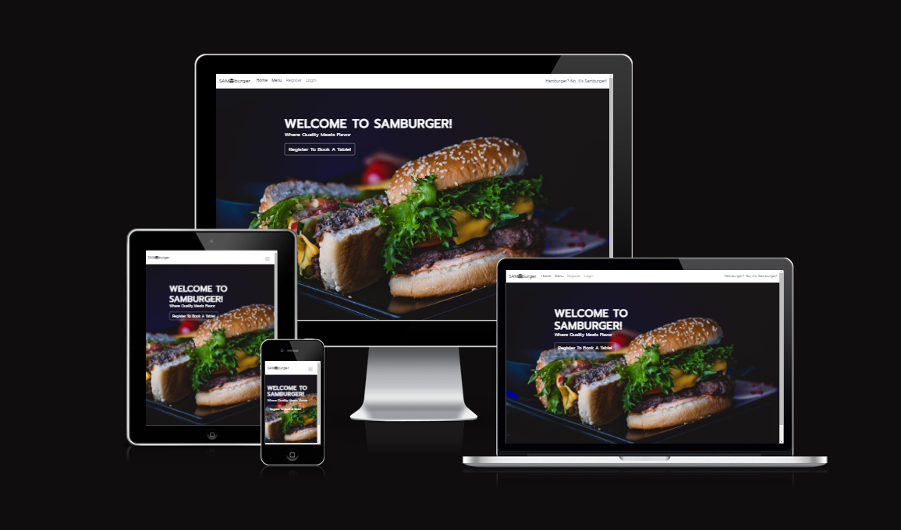

# UX-Design

## Design Thinking
When I started this project, my goal was to create a modern and user-friendly website that reflects the restaurant's style. I envisioned a clean header on the landing page and thought about what a first-time visitor would need:
* Easy access to our menu.
* A booking page.
* A booking details page with ability to cancel and update bookings.
* A navbar to help navigate through the website.
* Being able to create an account/login to easily view & create bookings.

From there I came up with my user stories.
## User Stories
* Create A Booking
  - As a site user I can make a booking so that I can book a specific time.
* View A Booking
  - As a site user I can to view my bookings so I can see the date and if I want to cancel or update bookings.
* Edit A Booking
  - As a site user I can edit my booking so that I can change the date and time.
* Cancel A Booking
  - As a site user I can cancel a booking so I can regret my decision if needed.
* Account registration
  - As a Site User I can register an account so that I can create, view and edit a booking.
* Add Comment
  - As a Site User I can leave a comment on the booking so that I can let the restaurant know any additional information.
* View Menu
  - As a Site User I can view the menu so I can know what they are offering.
* Navigation
  - As a Site User I can navigate through the navbar so I can easily navigate through the website.
* Footer Social Links
  - As a Site User I can click on social links that I can follow the restaurant on various social media pages.

## Diagram
I proceeded to create a diagram for the booking model I intended to utilize. This process provided me with a clearer understanding of the requirements for my models.

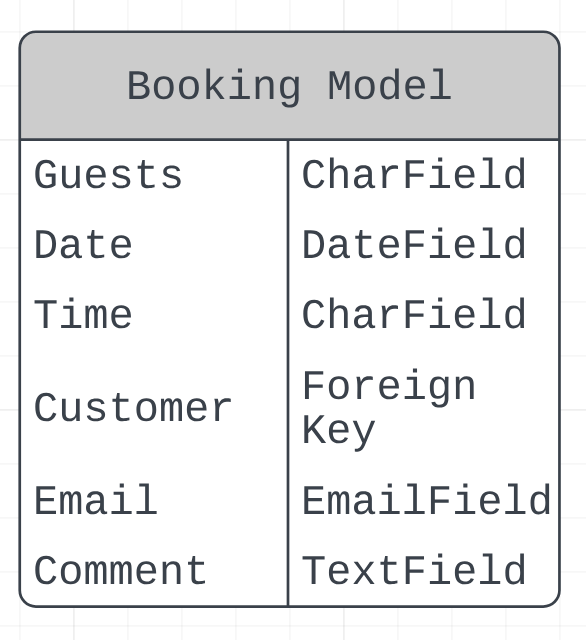

## Design
With the planning and user stories in place I thought of how I want the website to look and work.

#### Landing Page
* Hero image covering the whole screen in the background.
* Navbar that includes, register, login, booking details and a menu.
* Header with a button redirecting to the booking form

#### Menu Page
* Here I want the user to be able to view our menu.

#### Booking Page
* Form where the user inputs amount of guests, time, day and any additional comments. 
* When submitted I want the user to get a confirmation of the booking and redirected to the booking details page.

#### Booking Details Page
* Here I want the logged in user to be able to view, update and delete their current bookings.

#### Register Page
* Here I want the user to be able to create an account to be able to make bookings.

#### Login Page
* Here I want the user to be able to login to their existing account.

#### Logout Page
* Here I want the user to be able to logout of their account.

## Fonts & Colors

### Fonts
When choosing font I just wanted to keep it simple and clean thats why I choose this font:
- I used the 'Prompt' font from [Google Fonts](https://fonts.google.com) for this project.

### Colors
Same here when choosing colors I just wanted to keep it simple thats why I choose:
- White - #ffff
- Dark Grey - #212529
- Leather Brown - #301606 (Used on the booking form)

# Features

## Existing Features

* ### Navbar
  * The navigation bar includes links to Home, Menu, Register/Logout, Sign In, and Booking Details.
  * It is visible on all pages and includes the logo and navigation links.
  * The navigation bar is valuable for users as it provides quick and easy access to important sections of the website.

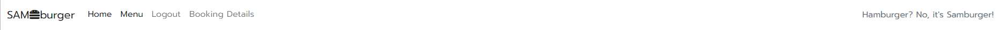

* ### Header/Hero Image
  * The "Welcome to Samburger!" header together with the image warmly greets visitors and sets a positive tone for their dining experience.
  * The "Book Now!" button makes it easy for users who are already logged in, allowing them to proceed directly to the booking process.
  * The "Register To Book A Table!" button makes it clear to users that they need to register an account before making a booking.

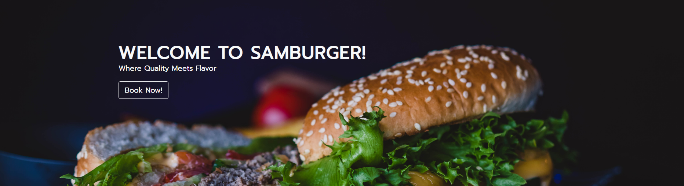

* ### Registration
  * Registration allows users to make a booking.
  * Sign Up feature is valuable for the user because it allows the user to view their existing bookings.
  * Sign Up feature is valuable for the user because it allows users to update & cancel their existing bookings.

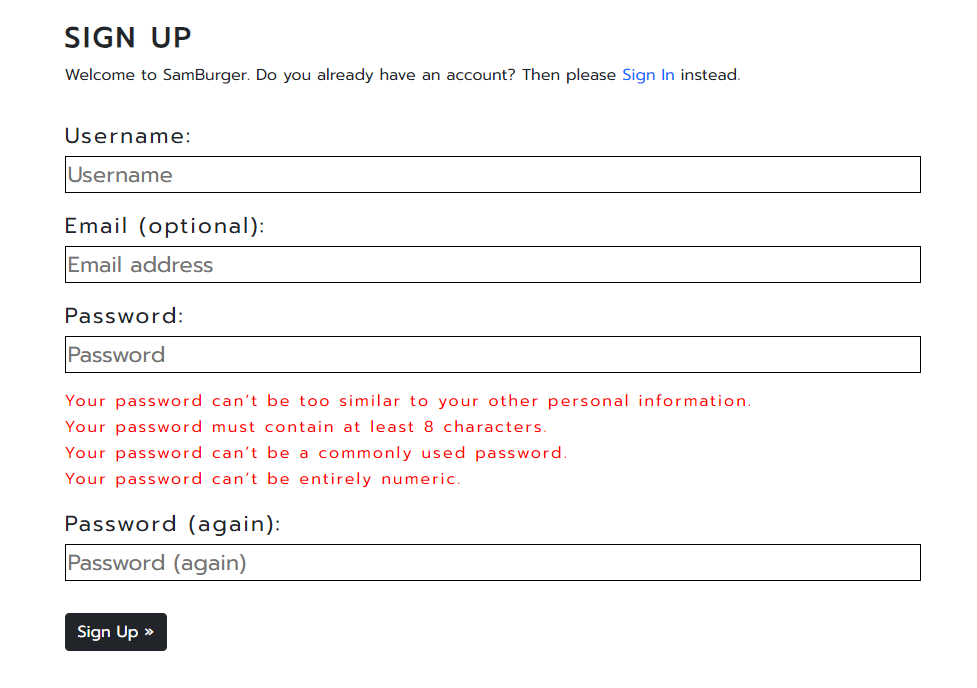

* ### Sign In
  * Sign In feature allows users to make a booking.
  * Sign In feature is valuable for the user because it allows the user to view their existing bookings.
  * Sign In feature is valuable for the user because it allows users to update & cancel their existing bookings.

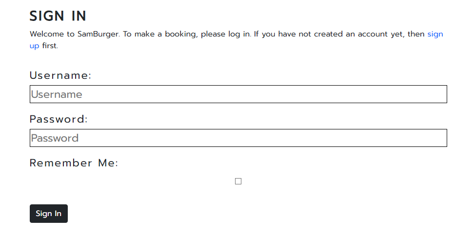

* ### Sign Out
  * Helps maintain account security by ensuring that no one else can access their account on the same device.
  * Users can protect their personal information by signing out, preventing unauthorized access to their account.
  * It's crucial for users who share devices to prevent others from accessing their account and data.

* ### Booking Form
  * Allows users to easily reserve a table at their preferred time, making dining plans hassle-free.
  * Users can specify their preferences, such as the number of guests and any special requests, giving them control over their dining experience.
  *  he form provides users with a booking confirmation, ensuring that their reservation is secured and eliminating any uncertainty.

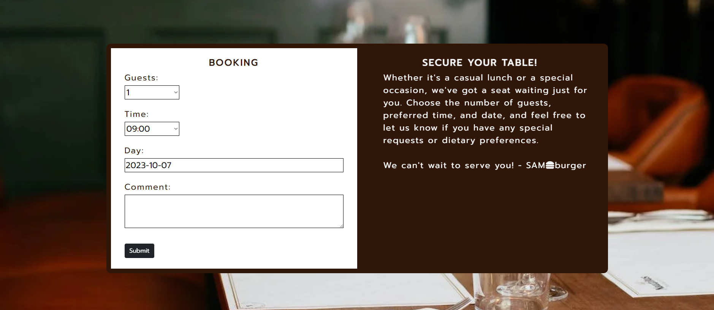

* ### Booking Details
  * Serves as a reference point for users to check the details of their reservations, including date, time, and guest count.
  * Users can easily update or cancel their bookings if their plans change, providing them with flexibility and convenience.
  *It reaffirms their upcoming dining plans, reducing any potential confusion or missed reservations.

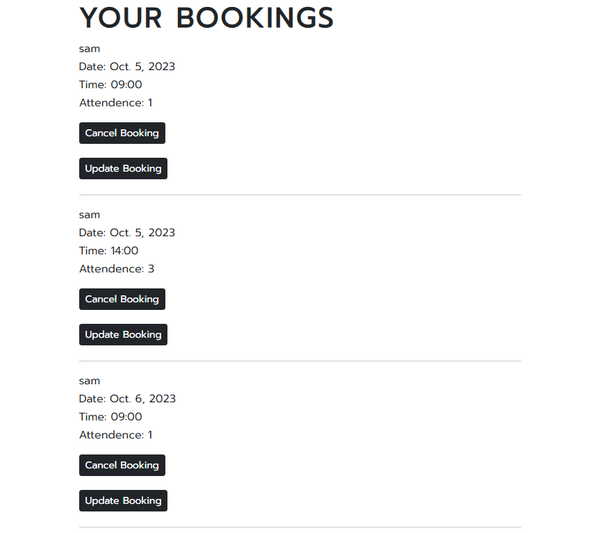

* ### Update Booking
  * Redirects the user to a modified booking form with their existing booking information pre-filled, simplifying the process of making changes or updates.
  * It allows users to make changes to their booking details, such as the number of guests or reservation time, providing flexibility to adapt to evolving plans.
  * It saves users time and effort by enabling quick and easy adjustments to their bookings without having to make a new one.

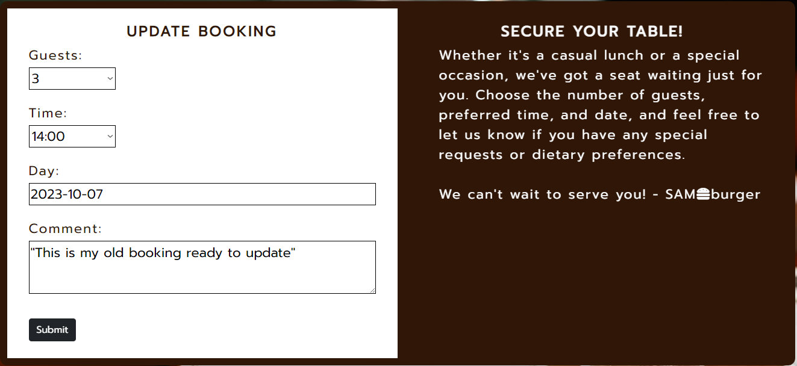

* ### Cancel Booking
  * Provides users with the freedom to cancel their booking when their plans change.
  * Respects users' time by allowing them to free up reserved slots for other customers if they can't make it.

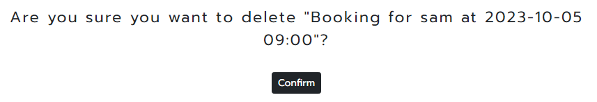

* ### Menu Page
  * Allows users to explore the variety of burgers offered by the restaurant.
  * Provides detailed information about menu items, helping users make informed decisions based on their preferences and dietary restrictions.
  * Enables users to plan their dining experience in advance by checking the menu options and prices.

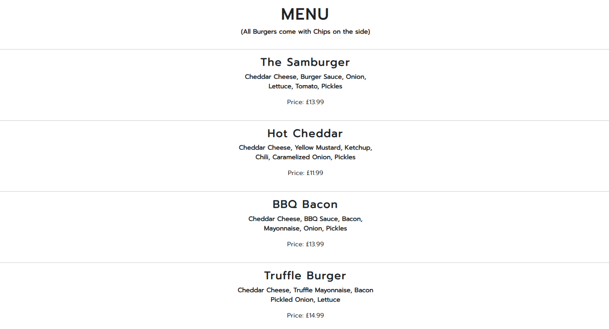

* ### Footer
  * Links that redirect to the resturant's social media pages. (Doesn't actually link to any page, because the resturant isn't real.)
  * Allows users to stay connected with the restaurant on social media platforms, keeping them informed about the latest dishes and events.
  * Provides an opportunity for users to engage with the restaurant's online community, share their experiences, and participate in discussions.

## Future Features
 * ### Choose A Table
    * This is a feature I will definitely add. If I had the time, it would have already been added.
    * The user would choose a table based on the available tables in the booking form.

# Technologies Used

## Frameworks, Libraries & Progams Used
  * [Django](https://www.djangoproject.com) Django served as the foundation of this project, used for the creation of models, forms, and views of the app.
  * [Cloudinary](https://www.cloudinary.com) Cloudinary was used as free cloud store CSS staticfiles.
  * [Bootstrap 5.1](https://getbootstrap.com/docs/5.1/getting-started/introduction/) Bootstrap 5.1 enhanced the project's user interface, enabling responsive and visually appealing design.
  * [ElephantSQL](https://www.elephantsql.com) was chosen for its reliable PostgreSQL database hosting, ensuring efficient data management for the project.
  * [Google Fonts](https://fonts.google.com) was used to import the 'Prompt' font in the style.css file which is used on all text on the website.
  * [Git](https://gitpod.io) Git was employed for version control by utilizing the GitPod terminal to commit changes and push them to GitHub.
  * [GitHub](https://github.com) was used to store the project code after being pushed from gitpod.
  * [Heroku](https://dashboard.heroku.com/) was used to host the project.

  * [Font Awesome](https://fontawesome.com) was used for fonts on the site.
  * [ChatGPT](https://chat.openai.com) was used to improve copyright.
  * [AmIresponsive](https://ui.dev/amiresponsive) was used for the readme pictures to ensure a visually appealing and responsive design presentation in the project documentation.
  * [LucidChart](https://lucid.app) was used to create my diagram Booking Model.
  
 ## Languages Used
 * HTML5
 * CSS3
 * Python3

# Testing

## Testing User Stories

| `Goals` | `How Are They Achieved?` |
| ----- | ---------------------- |
| `First time visitors` | |
| Understand what the website is and how to make a booking. | The "Register To Book A Table!" button makes it clear for the user how to make a booking. |
| View a detailed view of their booking.  | By making a booking they are redirected to the "Booking Details" page. |
| Convert into returning visitors.       | By providing a good and valuable customer experience. |
| `Returning Visitors`   |
| Make a new booking, update or cancel booking. | By providing a user-friendly platform that allows them to easily access and manage their reservations through their accounts |

## Full Testing
Full testing was performed on the following devices:
* PC:
  * Desktop PC
* Laptop:
  * Macbook Air 2021 13.6-inch screen
* Mobile Devices:
  * iPhone 13

Desktop PC tested the site using the following browsers:
* Google Chrome
* Opera
* Firefox

The Apple devices tested the site using the following browsers:
* Safari
* Google Chrome

I've confirmed that the site is responsive and looks good on different screen sizes.

## Manual Testing
| `Feature` | `Expected Outcome` | `Testing Performance` | `Result` | `Pass/Fail`|
| ----------|--------------------|-----------------------|----------|------------|
| `Navbar` |  |
| Logo  | When clicked user will be able to be redirected to the Home Page. | Clicked on logo | Redirected to the Home Page  | Pass |
| Home link | When clicked user will be able to be redirected to the Home Page. | Clicked on Home  | Redirected to the Home Page | Pass |
| Menu link | When clicked user will be able to be redirected to the Menu Page. | Clicked on Menu  | Redirected to the Menu Page | Pass |
| Register link | When clicked user will be able to be redirected to the Sign Up Page. | Clicked on Register  | Redirected to the Sign Up Page | Pass |
| Login link | When clicked user will be able redirected to the Sign In Page. | Clicked on Login  | Redirected to the Sign In Page | Pass |
| Booking Details | When clicked user will be able redirected to the Booking Details Page. | Clicked on Booking Details  | Redirected to the Booking Details Page | Pass |
| `Header`  | |
| "Book Now!/Register To Book A Table!" Button    | When clicked the user will be redirected to the Booking/Sign Up Page  | Clicked Button  |  Redirected to the Booking/Sign Up Page  | Pass |
| `Sign Up Form` |
| Sign In link | Redirected to sign in page | Clicked | Redirected to sign in page  | Pass |
| Taken Username | Sign up is unsuccessful | Entered a taken username | Sign up was unsuccessful  | Pass |
| Taken Email | Sign up is unsuccessful | Entered a taken Email | Sign up was unsuccessful  | Pass |
| Email without @ | Sign up is unsuccessful | Entered an Email without @ | Sign up was unsuccessful  | Pass |
| Password that's similar to username/email | Sign up is unsuccessful | Entered a password that's similar to username/email| Sign up was unsuccessful  | Pass |
| Password with less than 8 characters | Sign up is unsuccessful | Entered a password with less than 8 characters | Sign up was unsuccessful  | Pass |
| Commonly used password | Sign up is unsuccessful | Entered a commonly used password | Sign up was unsuccessful  | Pass |
| Numbers only password | Sign up is unsuccessful | Entered a numbers only password | Sign up was unsuccessful  | Pass |
| Valid Sign Up Form | Sign up is successful | Entered a valid sign up form | Sign up was successful  | Pass |
| `Sign In Form` |
| Sign Up link | Redirected to sign up page | Clicked | Redirected to sign up page  | Pass |
| Incorrect username | Sign in is unsuccessful | Entered a incorrect username | Sign in was unsuccessful  | Pass |
| Incorrect password | Sign in is unsuccessful | Entered a incorrect password | Sign in was unsuccessful  | Pass |
| Correct username & password | Sign in is successful | Entered a correct username & password | Sign in was successful  | Pass |
| Remember Me | Stayed logged in next time I enter site | Re-entered site | Still signed in  | Pass |
| `Sign Out Page` |
| Sign Out Button | Signed Out | Clicked Sign Out Button | Was signed out  | Pass |
| `Booking Form` |
| Past Date Submitted | Booking is unsuccessful | Entered a past date | Booking was unsuccessful  | Pass |
| Booking for an already booked time of the same user. | Booking is unsuccessful | Entered an already booked time | Booking was unsuccessful  | Pass |
| Valid Form | Get a booking confirmation | Entered a valid form | Got a confirmation of my booking  | Pass |
| `Booking Details Page` |
| Cancel Booking Button | Be able to confirm if I want to cancel booking | Clicked | Able to confirm if I want to cancel booking | Pass |
| Update Booking Button | Be able to update booking | Clicked | Able to update booking | Pass |
| `Update Booking` |
| Update Booking Form | Be able to update booking | Entered valid form | Able to update booking | Pass |
| `Cancel Booking` |
| Cancel Booking | Booking is canceled | Clicked confirm button | Booking was canceled | Pass |
| `Cancel Other User Booking` |
| Enter other user cancel booking url | Redirected to the 404 page | Enter url | Redirected to the 404 page | Pass |
| `Update Other User Booking` |
| Enter other user update booking url | Redirected to 404 the page | Enter url | Redirected to hte 404 page | Pass |
| `Footer` |
| Facebook Link | Redirected to Facebook page | Clicked | Redirected to Facebook page | Pass |
| Twitter Link | Redirected to Twitter page | Clicked | Redirected to Twitter page | Pass |
| Instagram Link | Redirected to Instagram page | Clicked | Redirected to Instagram page | Pass |
| YouTube Link | Redirected to YouTube page | Clicked | Redirected to YouTube page | Pass |

### Bugs
* No current bugs

#### Solved Bugs
* Couldn't get CSS to load on Deployed Heroku app.
* I fixed this by installing cloudinary to store CSS static files.

## Validation Testing
* HTML
  * Some error ocurred when passing through the official [W3C validator](https://validator.w3.org) this is because of Django. Other than that there was no errors.
* CSS
  * No errors were found when passing through the official [(Jigsaw) validator](https://jigsaw.w3.org/css-validator/)
* Pyhton
  * No errors were found when passing through the official [(CI Python Linter)](https://pep8ci.herokuapp.com)
* Accessibility

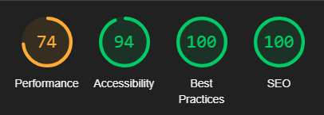

# Deployment

To deploy the project to Heroku, I followed these steps:
#### **Creating Heroku App:**
+ Logged into Heroku.
+ Selected 'Create New App' from the dashboard.
+ Chose a unique app name.
+ Selected region based on the location.
+ Clicked 'Create App'.

#### **Connecting to GitHub:**
+ From the Heroku dashboard, navigated to the 'Deploy' tab.
+ Under 'Deployment Method', chose 'GitHub'.
+ Searched and selected the repository by name.
+ Clicked 'Connect'.

#### **Setting Environment Variables:**
+ Went to the 'Settings' tab.
+ Located 'Config Vars' and clicked 'Reveal Config Vars'.
+ Added the necessary variables.

#### **Manual Deployment:**
+ Went back to the 'Deploy' tab.
+ Located 'Manual deploy' at the bottom of the page.
+ Clicked 'Deploy Branch' and waited for the build to finish.

#### **Accessing the App:**
+ After the deployment was successful, I found and clicked 'Open app' at the top of the app dashboard.

These steps ensured that the project was successfully deployed to Heroku.
The live link can be found here - [Samburger Website](https://project-portfolio-4-sam-335106eed664.herokuapp.com)

# Credits
## Code Used/Inspired
 * [CreateView](https://www.geeksforgeeks.org/createview-class-based-views-django/?ref=lbp)
 * [ListView](https://www.geeksforgeeks.org/listview-class-based-views-django/)
 * [UpdateView](https://www.geeksforgeeks.org/updateview-class-based-views-django/)
 * [DeleteView](https://www.geeksforgeeks.org/deleteview-class-based-views-django/)
 * [404 & 500 pages](https://stackoverflow.com/questions/17662928/django-creating-a-custom-500-404-error-page)
 * [Avoid past booking dates](https://stackoverflow.com/questions/70671189/avoid-booking-past-dates-with-django)
 * [Unique Together](https://docs.djangoproject.com/en/4.2/ref/models/options/)
 * [Avoid past booking dates](https://stackoverflow.com/questions/70671189/avoid-booking-past-dates-with-django)

## Media
* Landing Page image from [Pexels](https://images.pexels.com/photos/1199960/pexels-photo-1199960.jpeg)
* Booking Page image from [Pexels](https://images.pexels.com/photos/1484516/pexels-photo-1484516.jpeg?auto=compress&cs=tinysrgb&w=1260&h=750&dpr=1)
* [Favicon](https://www.flaticon.com/free-icon/hamburger_106277)
* [Favicon Generator](https://realfavicongenerator.net)